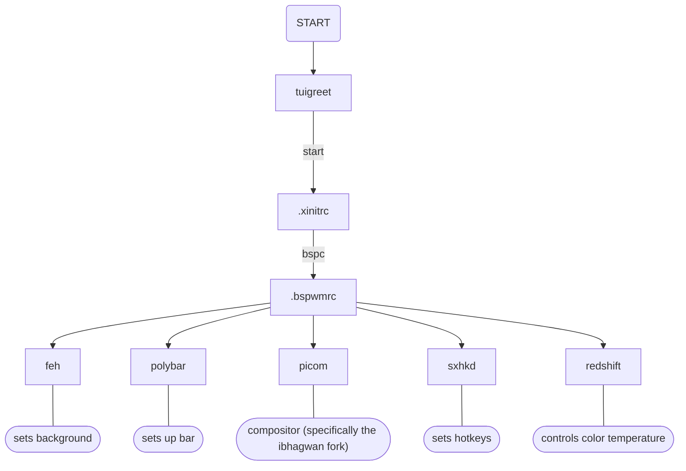
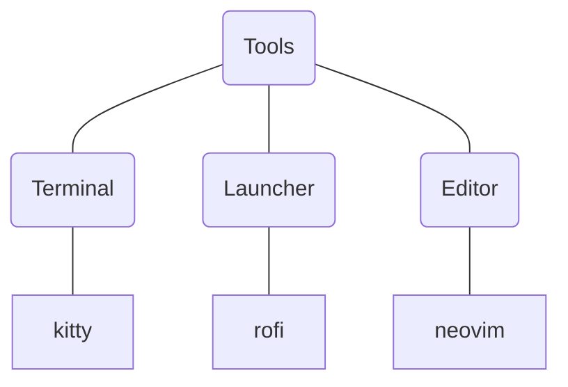

# How everything works

## Description

-   Theme:
    -   [Catppuccin Macchiato](https://github.com/catppuccin/catppuccin#-design-philosophy)
-   Background:
    -   [Cat Waves](https://github.com/catppuccin/wallpapers/blob/main/waves/cat-waves.png)
